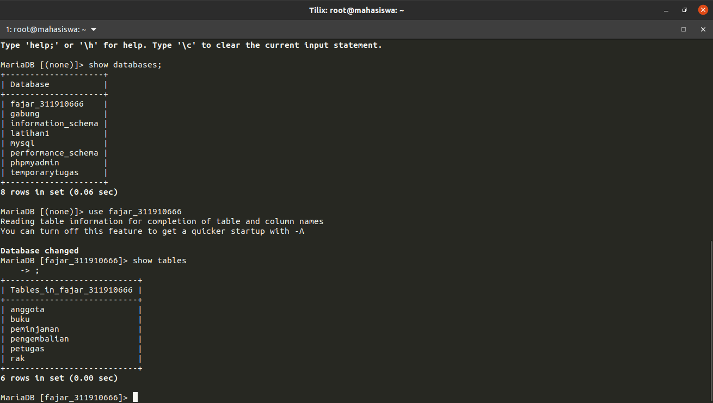
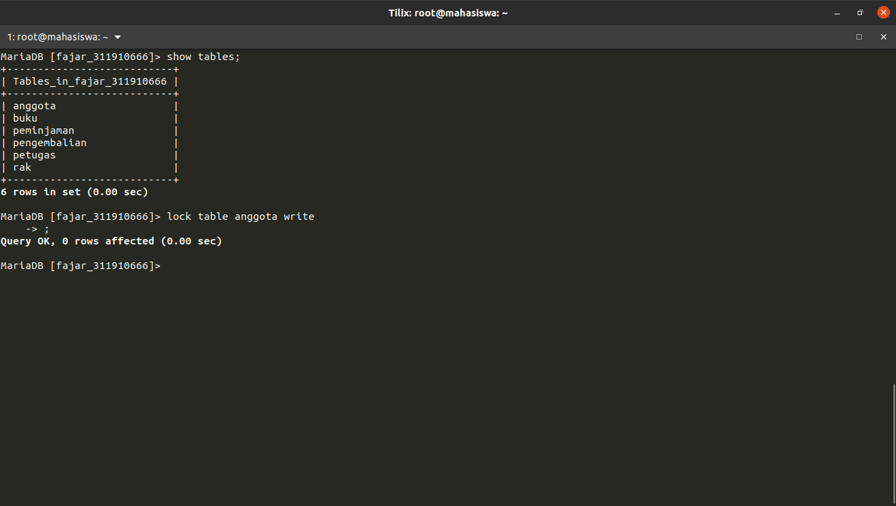
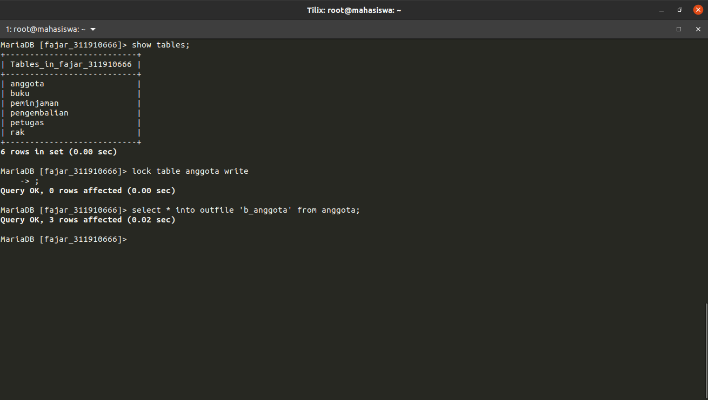
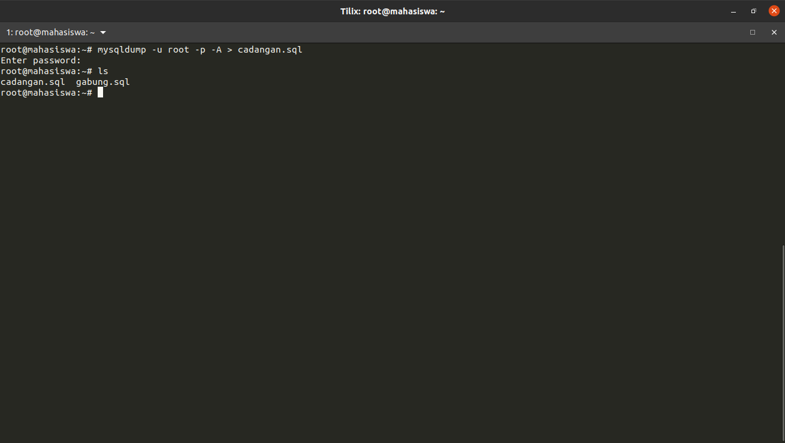
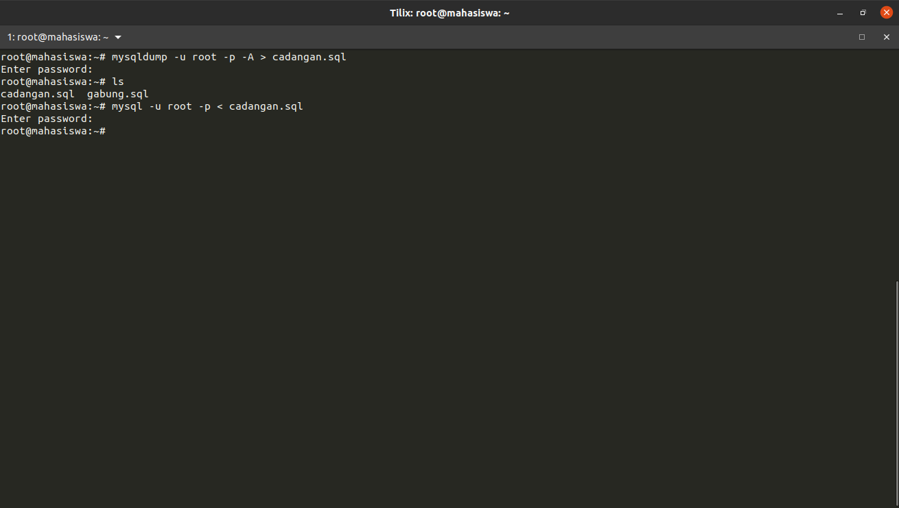
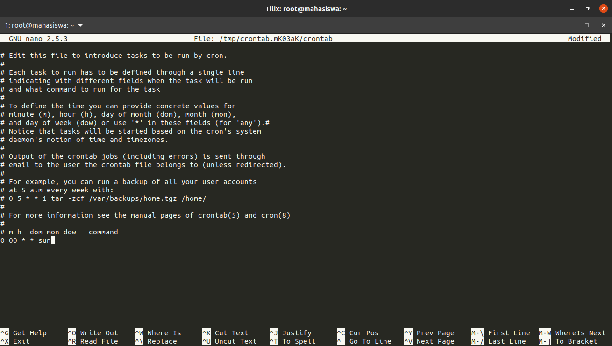

Fajar Arif Riyanto  
311910666  
TI 19 B2

1. Login ke Mysql.     
     

2. Lock dan show table.  
    

3. Backup Table dengan sql.    
    

4. Backup Database dengan perintah sqldump.  
     

5. Restore Database dengan sqldump.  
      
    <!--  -->

6. Backup database dengan cronjob setiap minggu jam 12 malam.  
      
    <!--   -->
